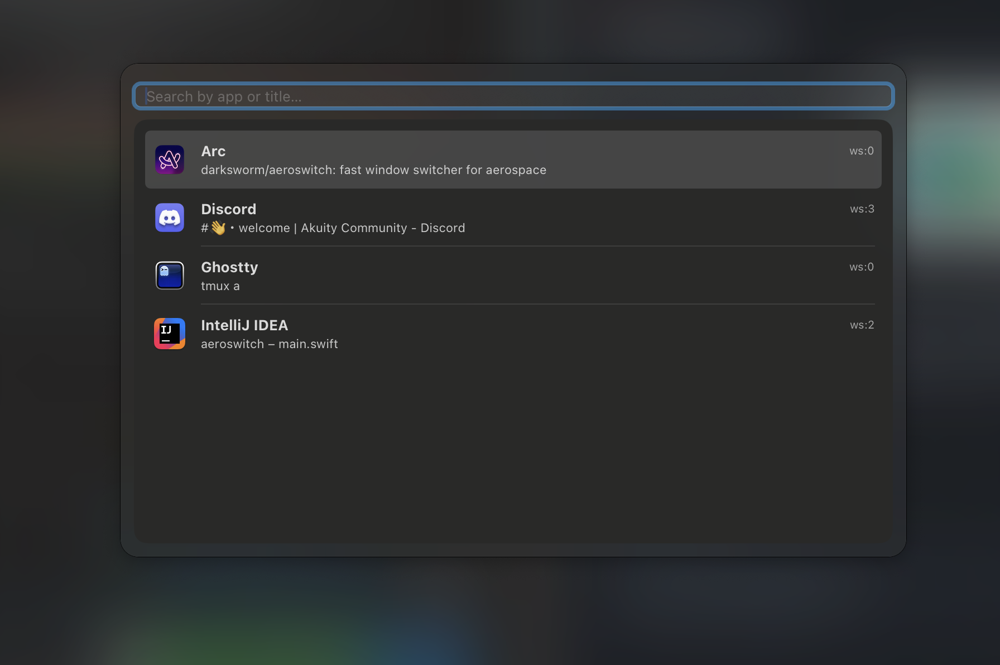

# AeroSwitch

<p align="center">
  
</p>

**A fast and lightweight window switcher for AeroSpace users**

AeroSwitch is designed for users who struggle with switching workspaces by number. Instead of memorizing workspace numbers, simply search for your applications by name and switch directly to any window across all workspaces.

## 🚀 Quick Start

### Installation

```bash
# Add the tap and install
brew tap darksworm/aerospace
brew install aeroswitch
```

### Setup AeroSpace

Add these lines to your AeroSpace configuration (`~/.aerospace.toml`):

```toml
# Auto-start AeroSwitch when AeroSpace starts
[[on-window-detected]]
if.app-id = 'com.apple.loginwindow'
run = '/opt/homebrew/bin/aeroswitch --background'

# Summon window switcher with Cmd+Tab
[mode.main.binding]
cmd-tab = 'exec-and-forget /opt/homebrew/bin/aeroswitch --activate'
```

### Start Using

1. **Restart AeroSpace** to load the new configuration
2. **Press Cmd+Tab** to open the window switcher
3. **Type to search** for windows by app name or title
4. **Use arrow keys** to navigate, **Enter** to switch, **Alt+Enter** to summon

That's it! 🎉

## ✨ Features

- **🔍 Smart Search**: Search windows by application name or window title
- **🚀 Lightning Fast**: Instant fuzzy search with intelligent scoring
- **🎨 Beautiful UI**: Translucent design with rounded corners and app icons
- **⌨️ Keyboard Driven**: Navigate entirely with keyboard shortcuts
- **🖱️ Mouse Support**: Click to select windows when preferred
- **📱 System Tray**: Unobtrusive system tray integration
- **🔄 Auto-Hide**: Automatically closes when losing focus
- **🎯 Two Strategies**: Choose between workspace focus or summon modes

## 🖼️ Screenshot



The window switcher displays a clean, searchable list of all windows across workspaces with:
- Application icons for easy visual identification
- App name and window title
- Current workspace indicator
- Translucent background that adapts to your desktop

## 📋 Prerequisites

- macOS 13.0 or later (supports both Intel and Apple Silicon)
- [AeroSpace](https://github.com/nikitabobko/AeroSpace) window manager
- Swift 6.1 or later (for building from source)

## ⚙️ Advanced Configuration

### Alternative Hotkeys

Don't want to override Cmd+Tab? Use these alternatives:

```toml
# Use Alt+Space instead
[mode.main.binding]
alt-space = 'exec-and-forget /opt/homebrew/bin/aeroswitch --activate'

# Or use Cmd+Shift+Tab
[mode.main.binding]
cmd-shift-tab = 'exec-and-forget /opt/homebrew/bin/aeroswitch --activate'
```

### Workspace Strategies

#### Summon Mode (Bring Windows to Current Workspace)
```toml
# Start with summon mode - brings windows to you
[[on-window-detected]]
if.app-id = 'com.apple.loginwindow'
run = '/opt/homebrew/bin/aeroswitch --background --summon'

[mode.main.binding]
cmd-tab = 'exec-and-forget /opt/homebrew/bin/aeroswitch --activate'
```

#### Both Modes Available
```toml
# Default background service
[[on-window-detected]]
if.app-id = 'com.apple.loginwindow'
run = '/opt/homebrew/bin/aeroswitch --background'

[mode.main.binding]
# Focus mode: go to window's workspace
cmd-tab = 'exec-and-forget /opt/homebrew/bin/aeroswitch --activate'
# Summon mode: bring window to current workspace
cmd-shift-tab = 'exec-and-forget /opt/homebrew/bin/aeroswitch --activate --summon'
```

### Command Line Options

```bash
aeroswitch [OPTIONS]

Options:
  --background    Start as background helper process
  --activate      Activate existing helper process  
  --summon        Use summon-workspace instead of workspace switching
  --help, -h      Show help message

Default behavior:
  If no flags are provided, will activate existing instance or start background process.
```

### Keyboard Shortcuts

- **Search**: Start typing to filter windows
- **Navigate**: Use `↑` and `↓` arrow keys to select windows
- **Activate**: Press `Enter` to switch to selected window
- **Summon**: Press `Alt+Enter` to bring window to current workspace  
- **Cancel**: Press `Esc` to close the switcher

### System Tray

Right-click the system tray icon for options:
- **Show Window Switcher**: Open the window switcher manually
- **Quit AeroSwitch**: Exit the application

## 🔧 Alternative Installation Methods

### Option A: Download Pre-built Binary

1. **Download the latest release:**
   - Go to [Releases](https://github.com/darksworm/aeroswitch/releases)
   - Download `aeroswitch-1.0.0-macos.tar.gz`

2. **Extract and install:**
   ```bash
   tar -xzf aeroswitch-1.0.0-macos.tar.gz
   sudo mv aeroswitch /usr/local/bin/
   chmod +x /usr/local/bin/aeroswitch
   ```

### Option B: Build from Source

```bash
git clone https://github.com/darksworm/aeroswitch.git
cd aeroswitch
make release
sudo make install
```

> **Note**: If you installed manually instead of Homebrew, use `/usr/local/bin/aeroswitch` instead of `/opt/homebrew/bin/aeroswitch` in your AeroSpace configuration.

## 💡 Tips & Troubleshooting

### Workspace Strategies

AeroSwitch supports two workspace switching strategies:

1. **Focus Mode** (default): Switches to the target workspace, then focuses the window
2. **Summon Mode**: Brings the window to the current workspace

### AeroSpace Integration

AeroSwitch automatically detects your AeroSpace installation in common locations:
- `/opt/homebrew/bin/aerospace`
- `/usr/local/bin/aerospace`  
- `/usr/bin/aerospace`

### Troubleshooting

**AeroSwitch won't start:**
- Check that the binary is executable: `chmod +x /usr/local/bin/aeroswitch`
- Verify AeroSpace is running: `ps aux | grep aerospace`

**Window switcher doesn't appear:**
- Make sure the background process is running: `ps aux | grep aeroswitch`
- Check AeroSpace logs for any errors

## 🔧 Development

### Building from Source

```bash
# Debug build
swift build

# Release build
swift build -c release

# Run tests (when available)
swift test
```

### Project Structure

```
aeroswitch/
├── Sources/
│   └── main.swift          # Main application code
├── Assets.xcassets/        # App icons and assets
│   └── AppIcon.appiconset/
├── Package.swift           # Swift Package Manager configuration
└── README.md              # This file
```

## 🤝 Contributing

Contributions are welcome! Please feel free to submit issues, feature requests, or pull requests.

### Development Guidelines

- Follow Swift conventions and best practices
- Test changes thoroughly with AeroSpace
- Update documentation for new features
- Use semantic commit messages

## 📝 License

This project is licensed under the GPL v3 License - see the [LICENSE](LICENSE) file for details.

## 🙏 Acknowledgments

- [AeroSpace](https://github.com/nikitabobko/AeroSpace) - The excellent tiling window manager that inspired this tool
- Swift and SwiftUI communities for excellent documentation and examples

## 📞 Support

If you encounter issues or have questions:

1. Check the [Issues](https://github.com/darksworm/aeroswitch/issues) page
2. Create a new issue with detailed information about your problem
3. Include your macOS version, AeroSpace version, and steps to reproduce

---

**Made with ❤️ for the AeroSpace community**